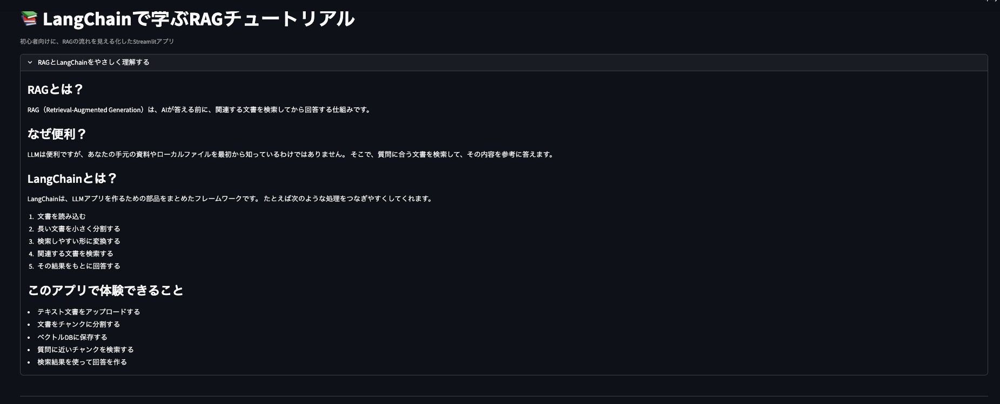
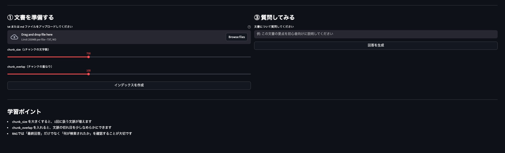
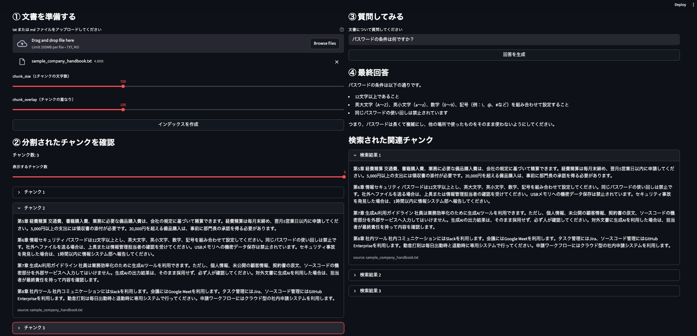
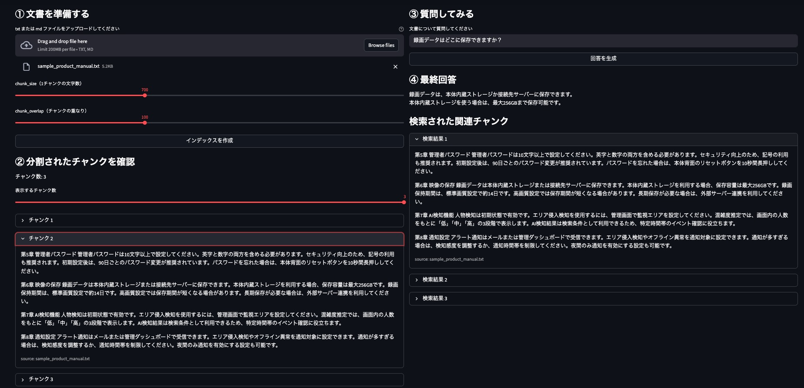

# langchain_rag_tutorial_app

LangChain と Streamlit を使って、RAG（Retrieval-Augmented Generation）の基本を学べる初心者向けチュートリアルアプリです。

このアプリでは、文書のアップロード、チャンク分割、ベクトルDBへの保存、関連チャンクの検索、回答生成までの流れを、UIで確認しながら体験できます。

## デモ画面
- webアプリ立ち上げ後は、RAG及びLangChainの概要を表示
  - 以下のデモ画面は`old_app_files`以下の`app_v1.py`実行時のUI

<p align="center">
  
</p>

- txtもしくはmd形式のファイル入力に対応しており、入力文章に対する質問を返してくれる

<p align="center">
  
</p>

### 回答例
- 作成したチュートリアルアプリの回答精度の検証を目的として、2つの文章を用意して回答精度を確認

1. [架空企業の社内ハンドブック](data/sample_company_handbook.txt)を作成し、期待通りの回答を得られれることを確認
    - パスワードの条件を質問し、社内ハンドブックに記載の情報を取得成功

<p align="center">
  
</p>

2. [架空製品マニュアル](data/sample_product_manual.txt)を作成し、期待通りの回答を得られることを確認
    - 録画データの保存先を質問し、製品マニュアル記載の情報を取得成功

<p align="center">
  
</p>

## 特徴

- LangChain を使った RAG の基本フローを学べる
- Streamlit でローカル実行しやすい
- 初学者向けの解説付き UI
- 検索されたチャンクを確認できる
- `.txt` と `.md` ファイルを対象にしたシンプルな構成

## ディレクトリ構成

```bash
langchain_rag_tutorial_app/
├── app.py
├── requirements.txt
├── README.md
├── .gitignore
├── .env
├── .env.example
└── data/
```

## 使用技術

- Streamlit
- LangChain
- langchain-openai
- langchain-community
- langchain-text-splitters
- ChromaDB
- python-dotenv

## 前提条件

- Python 3.10 以上を推奨
- OpenAI API キー

## セットアップ

### 1. リポジトリを作成またはクローン

```bash
git clone https://github.com/NaoyaTokiwa/langchain_rag_tutorial_app.git
cd langchain_rag_tutorial_app
```

### 2. 仮想環境を作成

```bash
python -m venv .venv
```

#### macOS / Linux

```bash
source .venv/bin/activate
```

#### Windows

```bash
.venv\Scripts\activate
```

### 3. パッケージをインストール

```bash
pip install -r requirements.txt
```

### 4. 環境変数を設定

`.env.example` をコピーして `.env` を作成し、OpenAI API キーを設定してください。

```bash
cp .env.example .env
```

`.env`:

```env
OPENAI_API_KEY=your_openai_api_key_here
```

## 実行方法

```bash
streamlit run app.py
```

起動後、ブラウザで表示されるローカルURLにアクセスしてください。

## アプリで学べること

1. 文書を読み込む
2. 文書をチャンクに分割する
3. 埋め込みを作成する
4. ベクトルDBに保存する
5. 質問に近いチャンクを検索する
6. 検索結果をもとに回答を生成する

## 注意点

- `.env` は機密情報を含むため、GitHub に push しないでください
- 初回実行時は埋め込み作成とベクトル化に少し時間がかかる場合があります
- LangChain のバージョンによって API 差分が出ることがあるため、`requirements.txt` は固定するのがおすすめです

## 今後の改善案

- プロンプト切り替え機能
  - 現在の ChatPromptTemplate.from_template(...) は1種類だけなので、「初心者向け」「要約重視」「箇条書き重視」 など複数のプロンプトを切り替えられるようにすると、プロンプト設計の影響を比較する。LangChainの ChatPromptTemplate が回答の文体・制約・出力形式を大きく左右することを確認予定。
- チャンク分割方式の比較
  - 現在はRecursiveCharacterTextSplitter のみだが、別の分割条件や chunk_size / chunk_overlap の比較表示を加えることで、前処理の設計が検索品質に直結することを確認する
- 会話履歴つきQ&A
  - answer_question(question) は単発質問だが、会話履歴を st.session_state に持たせて、前の質問と回答を参考に次の質問へつなげると、LangChainでのメモリ的な考え方を学べる。単発RAGと対話型RAGの違い、状態管理の重要性、将来的なLangGraph拡張を予定。
