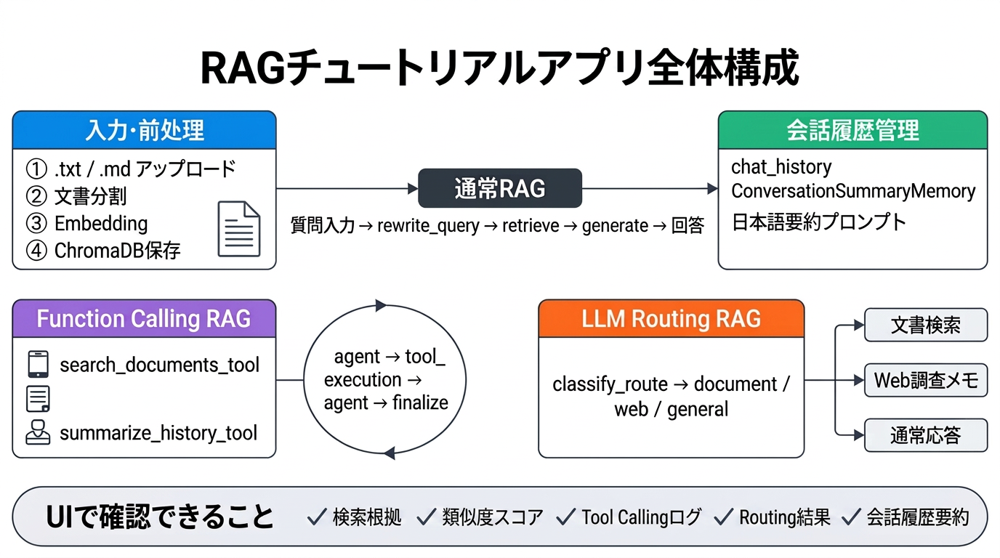
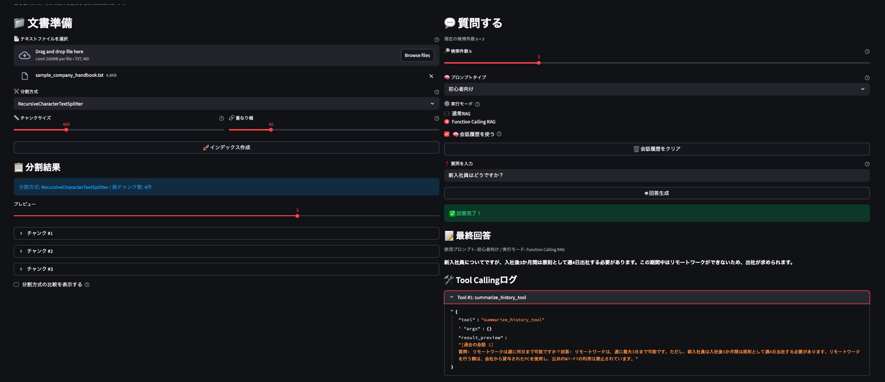
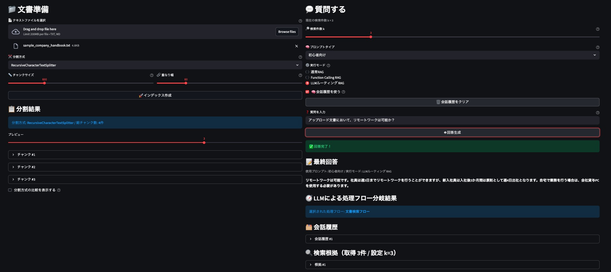
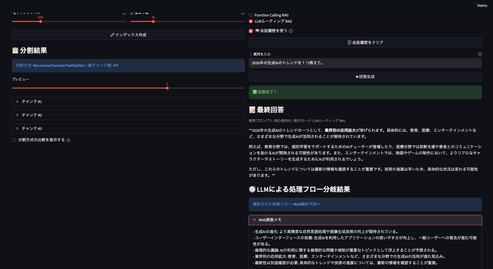
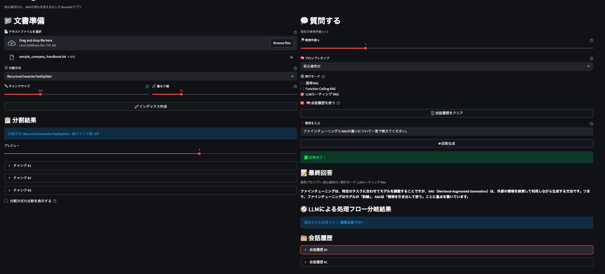
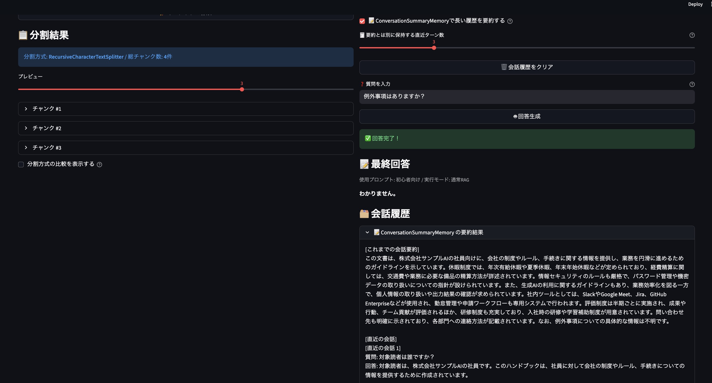

# langchain_rag_tutorial_app

LangChain、LangGraph、Streamlit を使って、RAG（Retrieval-Augmented Generation）の基本を学べる初心者向けチュートリアルアプリです。

このアプリでは、文書のアップロード、チャンク分割、埋め込み、ベクトルDB保存、検索、回答生成までの流れを、UIで確認しながら体験できます。加えて、検索件数 `k`、プロンプトタイプ、分割方式、**LangGraph を用いた会話履歴つきQ&A**、**Function Calling（Tool Calling）を用いたRAG**、**LLM Routing RAG** を切り替えながら、RAGの設計ポイントを比較学習できます。

⚠️本来であれば`app.py`を`config.py`や`ui.py`など役割ごとに分割する構成にする方が望ましいが、生成AI活用した修正を行いやすいように1つのファイルにて管理

<p align="center">
  
</p>

## このアプリでできること

- `.txt` / `.md` ファイルをアップロードしてRAG用インデックスを作成
- `RecursiveCharacterTextSplitter` と `CharacterTextSplitter` の比較
- `chunk_size` / `chunk_overlap` を調整して分割結果を確認
- 検索件数 `k` を変えて取得チャンク数を比較
- 類似度スコア（distance）を見ながら検索根拠を確認
- 「初心者向け」「要約重視」「箇条書き重視」のプロンプト切り替え
- 会話履歴あり / なし を切り替えて、単発RAGと対話型RAGを比較
- `ConversationSummaryMemory` による会話履歴の要約保持を確認
- LangGraph の `rewrite_query -> retrieve -> generate` フローを使った会話履歴つきQ&A
- `通常RAG` / `Function Calling RAG` / `LLM Routing RAG` の実行モード比較
- `search_documents_tool()` / `summarize_history_tool()` を使った Tool Calling の学習
- Tool Callingログを見ながら、LLM がどのツールを呼んだか確認
- LLM Routing結果を見ながら、質問がどの経路に分類されたか確認
- 検索根拠、会話履歴、最終回答を同じ画面で確認

## RAGの流れ

```text
文書読み込み → 分割 → 埋め込み → ベクトルDB保存

通常RAG:
質問入力 → LangGraphで質問補完 → 類似検索 → 根拠取得 → LLM回答生成
                         ↑
                   会話履歴を参照

Function Calling RAG:
質問入力 → agent(LLM) → 必要に応じてTool Calling → tool_execution → agent(LLM) → finalize
                               ↓
               search_documents_tool / summarize_history_tool

LLM Routing RAG:
質問入力 → route_question で分類
          ├→ document: rewrite_query → retrieve → generate_document_answer
          ├→ web: search_web_context → generate_web_answer
          └→ general: general_answer
```

- LLM単体では、学習済み知識だけを頼りに回答します。
- RAGでは、アップロードした文書を検索して、その内容を参考に回答します。
- このアプリでは、さらに LangGraph を使って会話履歴を検索前段にも反映し、曖昧な follow-up 質問を補完してから検索します。
- また、長い会話履歴は `ConversationSummaryMemory` で日本語要約し、直近ターンと組み合わせてプロンプトへ渡すことで、トークン増加を抑えつつ対話の一貫性を保ちます。
- また、Function Calling RAG では、LLM が必要に応じて `search_documents_tool()` や `summarize_history_tool()` を選び、ツール結果を使って最終回答を作る流れも学べます。
- LLM Routing RAG では、質問内容を `document / web / general` に分類し、文書検索・Web向け回答・通常回答のどれが適切かを判定してから処理を進めます。

## 学習ポイント

### 1. 文書分割の重要性

- `chunk_size` を大きくすると文脈を多く含めやすい一方で、検索粒度は粗くなります。
- `chunk_overlap` を増やすと文脈切れは防ぎやすいですが、重複も増えます。
- 分割方式によって、同じ文書でもチャンク数や切れ方が変わります。

### 2. Retriever設計の比較

- 検索件数 `k` を小さくすると、根拠は絞られますが情報不足になりやすいです。
- `k` を大きくすると、情報量は増えますがノイズも混ざりやすくなります。
- LangGraph の質問補完を入れることで、省略質問でも検索精度を上げやすくなります。

### 3. Prompt設計の比較

- **初心者向け**: 背景を含めてやさしく説明します。
- **要約重視**: 要点を短く返します。
- **箇条書き重視**: 情報を整理して返します。
- 同じ検索結果でも、プロンプト次第で回答の見せ方が変わります。

### 4. LangGraphを使った会話履歴つきQ&A

- 会話履歴OFFでは、各質問を独立した単発RAGとして扱います。
- 会話履歴ONでは、前の質問と回答を `st.session_state` に保持しつつ、LangGraph の `rewrite_query_node()` で検索用質問へ補完します。
- その後 `retrieve_node()` で補完済みクエリ検索、`generate_node()` で回答生成を行います。
- これにより、単発RAGと対話型RAGの違いだけでなく、**検索前に文脈補完する重要性** も学べます。

### 4.5 ConversationSummaryMemory による履歴要約

- 長い会話履歴をそのまま毎回 LLM に渡すと、トークン消費が増え、応答速度やコストに影響しやすくなります。
- そこでこのアプリでは、`ConversationSummaryMemory` を使って過去会話を**日本語で要約**し、さらに直近の数ターンをそのまま残す構成を採用しています。
- 実装上は `format_chat_history_with_summary()` が、`[これまでの会話要約]` と `[直近の会話]` をまとめてプロンプトへ渡します。
- 要約には `SUMMARY_PROMPT_JA` を使っており、要約文が英語ではなく日本語で更新されるようにしています。
- UI では `ConversationSummaryMemoryで長い履歴を要約する` のチェックボックスと、`要約とは別に保持する直近ターン数` のスライダーで挙動を切り替えられます。
- さらに、`会話履歴` セクション内の `ConversationSummaryMemory の要約結果` から、内部でどのように履歴が圧縮されているかを確認できます。

### 5. Function Calling（Tool Calling）の学習

- 実行モードを `Function Calling RAG` に切り替えると、LLM が必要に応じてツールを選択します。
- `search_documents_tool()` はベクトルDBを検索し、検索根拠を返します。
- `summarize_history_tool()` は直近の会話履歴を要約し、follow-up 質問の補助に使えます。
- LangGraph では `agent -> tool_execution -> agent -> finalize` という流れで、LLM とツール実行を分離して学べます。
- UI の Tool Callingログから、どのツールがどんな引数で呼ばれたか確認できます。

### 6. LLM Routing の学習

- 実行モードを `LLM Routing RAG` に切り替えると、`classify_route_with_llm()` が質問を `document / web / general` の3経路に分類します。
- `document` ルートでは、`routing_rewrite_query_node()` → `routing_retrieve_node()` → `routing_generate_document_answer_node()` の流れで、通常RAGに近い文書検索ベースの回答を行います。
- `web` ルートでは、`search_web_context()` が外部情報用の調査メモを生成し、`routing_generate_web_answer_node()` がその内容をもとに回答します。
- `general` ルートでは、`general_answer_node_response()` を使って、検索を行わず通常のLLM回答を返します。
- ルーティングには会話履歴も使うため、follow-up 質問でも前後関係を踏まえて route を選びやすくしています。
- UI では `LLM Routing結果` が表示され、`web` ルート時には `Web調査メモ` も確認できます。

## アプリ画面

### メイン画面

<p align="center">
  
</p>

## 回答例

### 単発RAGの例

1. [架空企業の社内ハンドブック](data/sample_company_handbook.txt) を入力
2. 「リモートワークは何日まで可能？」と質問
3. 検索された根拠に基づいて回答できることを確認

### 会話履歴あり・なしの比較例

以下は、架空企業の社内ハンドブックを入力し、次の2つの質問を順番に行った例です。

1. `リモートワークは何日まで可能？`
2. `その根拠は？`

- **会話履歴あり**: LangGraph が1つ目の質問内容を踏まえて2つ目の質問を補完しやすい
- **会話履歴なし**: 2つ目の質問だけでは対象が曖昧になりやすい

#### 会話履歴あり

<p align="center">
  
</p>

#### 会話履歴なし

<p align="center">
  
</p>

#### Tool Callingの動作確認例

以下は、`リモートワークが週に何回可能か?` と質問した後に、`新入社員に対してはどうか?` と聞いた際の結果です。

<p align="center">
  
</p>

- Function Calling RAG では、LLM が必要に応じて `search_documents_tool()` や `summarize_history_tool()` を呼び出します。
- 前の質問内容を踏まえつつ、ツール結果を根拠に次の回答を作る流れを確認できます。


#### LLM Routingの動作確認例

以下は、LLM Routing RAG において質問内容に応じて `document` / `web` / `general` の各ルートへ分岐した際の出力例です。

- `document` ルート: 架空企業の社内ハンドブック文書を検索して回答する例

<p align="center">
  
</p>

- `web` ルート: Web調査メモをもとに回答する例

<p align="center">
  
</p>

- `general` ルート: 文書検索やWeb調査を使わず通常回答する例

<p align="center">
  
</p>

- `document` ルートでは、文書検索ベースで根拠を参照しながら回答します。
- `web` ルートでは、外部情報向けの調査メモを生成してから回答します。
- `general` ルートでは、検索を行わず通常のLLM応答を返します。

### ConversationSummaryMemory による履歴要約例

以下は、[架空企業の社内ハンドブック](data/sample_company_handbook.txt) を入力し、`ConversationSummaryMemoryで長い履歴を要約する` をオンにした状態で、次の4つの質問を順番に入力した際の例です。
このとき、`要約とは別に保持する直近ターン数` は `3` に設定しています。

1. 「この文書の目的を教えてください」
2. 「対象読者は誰ですか？」
3. 「重要なルールを箇条書きで整理してください」
4. 「例外事項はありますか？」

<p align="center">
  
</p>

- 過去の会話全体は `ConversationSummaryMemory` によって日本語で要約されます。
- 直近3ターンは要約とは別にそのまま保持されるため、最新の文脈を落としにくくなります。
- これにより、長い会話でもトークン消費を抑えながら、follow-up 質問への対応を続けやすくなります。

### 他の回答例

#### 社内ハンドブック

<p align="center">
  
</p>

#### 製品マニュアル

<p align="center">
  
</p>

## 使用技術

- Streamlit
- LangChain
- LangGraph
- langchain-openai
- langchain-community
- langchain-text-splitters
- ChromaDB
- python-dotenv

## ディレクトリ構成

```bash
langchain_rag_tutorial_app/
├── app.py
├── README.md
├── docs.md
├── requirements.txt
├── .env.example
├── data/
├── images/
└── chroma_db/  # 実行時に作成
```

## 前提条件

- Python 3.10 以上を推奨
- OpenAI API キー

## セットアップ

### 1. リポジトリをクローン

```bash
git clone https://github.com/NaoyaTokiwa/langchain_rag_tutorial_app.git
cd langchain_rag_tutorial_app
```

### 2. 仮想環境を作成して有効化

```bash
python -m venv .venv
```

#### macOS / Linux

```bash
source .venv/bin/activate
```

#### Windows

```bash
.venv\Scripts\activate
```

### 3. パッケージをインストール

```bash
pip install -r requirements.txt
```

### 4. 環境変数を設定

`.env.example` をコピーして `.env` を作成し、OpenAI API キーを設定します。

```bash
cp .env.example .env
```

`.env`:

```env
OPENAI_API_KEY=your_openai_api_key_here
```

## 実行方法

```bash
streamlit run app.py
```

起動後、ブラウザで表示されるローカルURLにアクセスしてください。

## 使い方

1. 左カラムで `.txt` または `.md` ファイルをアップロードします。
2. 分割方式、`chunk_size`、`chunk_overlap` を設定します。
3. 「🚀 インデックス作成」を押します。
4. 必要に応じて分割結果や分割方式比較を確認します。
5. 右カラムで検索件数 `k`、プロンプトタイプ、実行モード、会話履歴ON/OFFを設定します。
6. 必要に応じて `ConversationSummaryMemoryで長い履歴を要約する` をオンにし、直近保持ターン数を調整します。
7. 実行モードを `通常RAG` にすると、LangGraph の `rewrite_query -> retrieve -> generate` フローで回答します。
8. 実行モードを `Function Calling RAG` にすると、LLM が `search_documents_tool()` や `summarize_history_tool()` を必要に応じて呼び出します。
9. 実行モードを `LLM Routing RAG` にすると、質問内容に応じて `document / web / general` の経路へ自動分岐します。
10. 質問を入力して「🤖 回答生成」を押します。
11. 最終回答、会話履歴、検索根拠、類似度スコア、必要に応じて Tool Callingログや LLM Routing結果、ConversationSummaryMemory の要約結果を確認します。

## 注意点

- `.env` は機密情報を含むため、GitHub に push しないでください。
- 初回実行時は埋め込み作成とベクトル化に少し時間がかかる場合があります。
- `chroma_db` は実行時に再作成されます。
- LangChain のバージョン差分でAPIが変わることがあるため、`requirements.txt` の固定管理をおすすめします。

## ~~今後の改善案~~ -->　完了
- 検索件数 k の可変化 --> 実装済み
  - ~~`answer_question()`では現在`search_kwargs={"k": 3}`で固定されているが、UIから変更できるようにすることで、Retrieverが何件の文書を返すかで回答がどう変わるかを比較できる。`as_retriever()`の役割、検索件数と回答精度の関係、ノイズ混入の感覚を把握できる。~~
- 類似度スコアの表示 --> 実装済み
  - ~~今は retriever.invoke(question) で文書だけを取得しているが、スコア付き検索に変えると、「なぜそのチャンクが選ばれたのか」 を見える化できる。ベクトル検索が単なる文字一致ではなく、埋め込み空間での近さで選ばれていることを確認できる。~~
- プロンプト切り替え機能 --> 実装済み
  - ~~現在の ChatPromptTemplate.from_template(...) は1種類だけなので、「初心者向け」「要約重視」「箇条書き重視」 など複数のプロンプトを切り替えられるようにすると、プロンプト設計の影響を比較する。LangChainの ChatPromptTemplate が回答の文体・制約・出力形式を大きく左右することを確認予定。~~
- チャンク分割方式の比較  --> 実装済み
  - ~~現在はRecursiveCharacterTextSplitter のみだが、別の分割条件や chunk_size / chunk_overlap の比較表示を加えることで、前処理の設計が検索品質に直結することを確認する~~
- 会話履歴つきQ&A --> 実装済み
  - ~~answer_question(question) は単発質問だが、会話履歴を st.session_state に持たせて、前の質問と回答を参考に次の質問へつなげると、LangChainでのメモリ的な考え方を学べる。単発RAGと対話型RAGの違い、状態管理の重要性、将来的なLangGraph拡張を予定。~~
- LangGraphを用いた会話履歴つきQ&A --> 実装済み
- Function Calling(Tool Callingの一種)  --> 実装済み
    - ~~Tool Calling：LLM が必要に応じて外部ツールを選んで実行し、その結果を使って最終回答を作る仕組み~~
    - ~~LLMが必要に応じてPython関数や外部処理を呼び出せるようにし、文書検索・履歴要約・条件分岐をより柔軟に制御できる構成を学べるようにする。~~
- LLM Routing  -> 実装済み
    - ~~質問内容に応じて、文書検索・Web検索・通常応答など最適な処理経路へ分岐し、精度と効率の両立を学べるようにする。~~
- History Compression --> 実装済み
    - ~~`ConversationSummaryMemory` と日本語要約プロンプトを使い、長い会話履歴を圧縮しつつ直近ターンを保持できるようにした。~~


## 難しかった点・課題
- プロンプト設計が不十分だと、履歴要約が英語になったり、意図した回答形式やツール選択にならなかった。特に ConversationSummaryMemory では日本語要約用のプロンプトを明示する重要性を実感した。
- Function Calling では、ツールを定義しただけでは十分ではなく、「どの質問でどのツールが呼ばれるべきか」を安定させる設計が難しかった。
- 最もらしい回答を得られるところまでざっと理解できたが、得られた回答に対する定量的な評価ができていないのが課題と感じた。定量評価の導入も検討してみたい。
