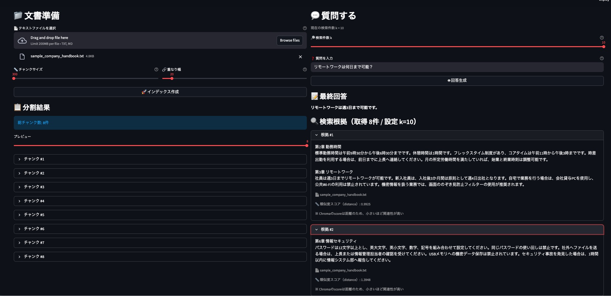
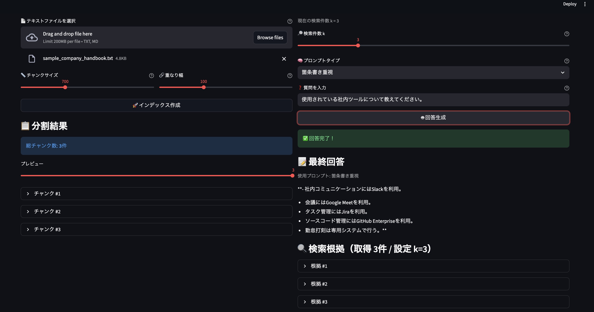
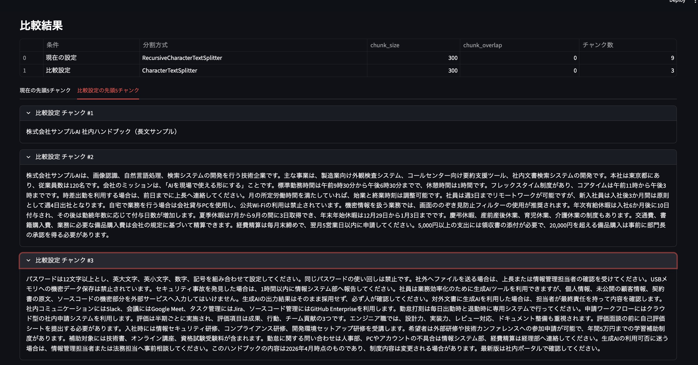
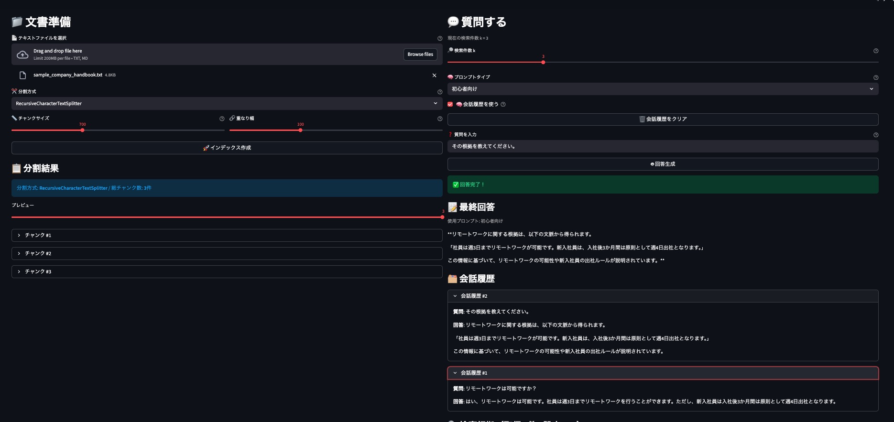
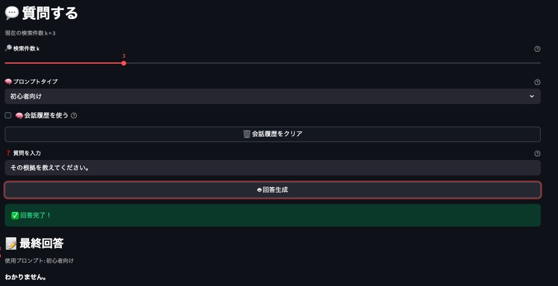

## 📋 各メソッド概要（LangChain重点）

### 1. RAG全体フロー
```text
📄 Load → ✂️ Split → 🔢 Embed → 🗄️ Store → 🔍 Retrieve → 🧠 Prompt → 🤖 Generate
                                   ↓
                            🗂️ Chat History
```

### 2. 補助関数一覧
| 関数名 | 役割 | LangChainコンポーネント | RAGフェーズ |
|--------|------|-------------------|-------------|
| `check_api_key()` | APIキー確認 | - | 前処理 |
| `read_uploaded_file()` | txt / md を `Document` に変換 | `Document` | Load |
| `split_documents()` | 分割方式に応じて文書をチャンク化 | `RecursiveCharacterTextSplitter`, `CharacterTextSplitter` | Split |
| `build_vectorstore()` | 分割 → 埋め込み → Chroma保存 | `TextSplitter`, `OpenAIEmbeddings`, `Chroma` | Split + Store |
| `format_chat_history()` | 直近の会話履歴を整形 | - | Memory補助 |
| `get_prompt_template()` | プロンプト切り替え | `ChatPromptTemplate` | Prompt |
| `answer_question()` | 検索 → 会話履歴付与 → プロンプト適用 → LLM回答生成 | `Chroma`, `ChatPromptTemplate`, `ChatOpenAI`, `chain` | Retrieve + Generate |

### 3. LangChain重点解説

#### `read_uploaded_file()` - Loadフェーズ
```python
Document(page_content=text, metadata={"source": filename})
```

- 役割: StreamlitのアップロードファイルをLangChain標準の `Document` 形式に変換する
- `Document` は本文 `page_content` と出典情報 `metadata` を持つ
- `metadata` にファイル名を持たせることで、根拠表示やデバッグに使える
- RAGでは、後続処理が `Document` を前提に進む

#### `split_documents()` - Splitフェーズ
```python
if splitter_type == "RecursiveCharacterTextSplitter":
    splitter = RecursiveCharacterTextSplitter(
        chunk_size=chunk_size,
        chunk_overlap=chunk_overlap
    )
elif splitter_type == "CharacterTextSplitter":
    splitter = CharacterTextSplitter(
        separator="\n\n",
        chunk_size=chunk_size,
        chunk_overlap=chunk_overlap
    )

split_docs = splitter.split_documents(documents)
```

- 分割方式に応じて TextSplitter を切り替えるための関数
- `RecursiveCharacterTextSplitter` は改行・空白など複数の区切り候補を段階的に使う
- `CharacterTextSplitter` は指定した区切り文字を基準に比較的単純に分割する
- 同じ文書でも、分割方式によってチャンク数やチャンク境界が変わる

#### `build_vectorstore()` - Split + Storeフェーズ
```python
split_docs = split_documents(
    documents,
    splitter_type,
    chunk_size,
    chunk_overlap
)

embeddings = OpenAIEmbeddings(model="text-embedding-3-small")

vectorstore = Chroma.from_documents(
    split_docs,
    embeddings,
    persist_directory="chroma_db"
)
```

- `split_documents()` で選択中の分割方式に応じてチャンク化する
- `OpenAIEmbeddings` で各チャンクをベクトル化する
- `Chroma` に保存することで、類似検索できる状態にする

**LangChainの基本パターン**
```text
TextSplitter → OpenAIEmbeddings → Chroma.from_documents
     ↓                 ↓                   ↓
 文書分割 → 文章→ベクトル変換 → 類似検索可能DB作成
```

#### `format_chat_history()` - Memory補助
```python
def format_chat_history(chat_history, max_turns=3):
    recent_history = chat_history[-max_turns:]

    if not recent_history:
        return "会話履歴なし"
```

- `st.session_state.chat_history` に保存した会話履歴を、LLMへ渡しやすい文字列へ整形する
- 直近数ターンだけを使うことで、文脈補完とプロンプト量のバランスを取る
- LangChain標準のMemoryクラスではないが、会話状態を扱う考え方を学べる
- 将来的に LangGraph の状態管理へ拡張する前段として理解しやすい

#### `get_prompt_template()` - Promptフェーズ
```python
def get_prompt_template(prompt_type):
    templates = {
        "初心者向け": "...",
        "要約重視": "...",
        "箇条書き重視": "..."
    }
    return ChatPromptTemplate.from_template(templates[prompt_type])
```

- 回答スタイルをプロンプトごとに切り替えるための関数
- `ChatPromptTemplate` をテンプレートごとに出し分ける
- 同じ検索結果でも、プロンプト次第で回答の形を変えられる
- 会話履歴をテンプレート変数に追加することで、単発RAGと対話型RAGを切り替えられる

#### `answer_question()` - Retrieve + Generateフェーズ
```python
retrieved_results = vectorstore.similarity_search_with_score(question, k=k)
retrieved_docs = [doc for doc, score in retrieved_results]
context_text = "\n\n".join([doc.page_content for doc in retrieved_docs])

prompt = get_prompt_template(prompt_type)
llm = ChatOpenAI(model="gpt-4o-mini", temperature=0)
chain = prompt | llm
response = chain.invoke({
    "chat_history": history_text,
    "context": context_text,
    "question": question
})
```

- `similarity_search_with_score()` で、質問に近いチャンクをスコア付きで取得する
- 取得したチャンク本文を結合して `context_text` を作る
- `format_chat_history()` で会話履歴を整形し、質問の前提文脈として渡す
- `get_prompt_template(prompt_type)` で選択中のプロンプトを取得する
- `ChatOpenAI` に会話履歴・参考文脈・質問を渡して回答を生成する

**LangChainの直感的パイプライン**
```text
similarity_search_with_score → context_text ┐
format_chat_history          → history_text ├→ get_prompt_template → ChatOpenAI → 回答
質問入力                     → question      ┘
```

### 4. 検索件数 `k` の可変化
検索件数 `k` を可変にすると、何件の関連チャンクを取得するかをUIから調整できます。

```python
retrieved_results = vectorstore.similarity_search_with_score(question, k=k)
```

この機能により、Retriever設計のトレードオフを確認できます。

- `k=1` の場合: 根拠が少なく、回答が短くなりやすい
- `k=5` 以上の場合: 根拠は増えるが、関係の薄い情報も混ざりやすい

つまり、`k` は「情報量」と「ノイズ量」のバランスを見ながら調整する必要があります。

### 5. 類似度スコア表示
検索結果ごとにスコアを表示すると、「なぜそのチャンクが選ばれたのか」を確認できます。

```python
for doc, score in retrieved_results:
    print(score)
```

- スコアを見ることで、各チャンクの近さを比較できる
- Chroma の `similarity_search_with_score()` が返す値は一般に **distance（距離）**
- **値が小さいほど関連性が高い** と解釈する

この表示により、Retriever・Embedding・Chunk設計の影響を可視化できます。  
類似度スコアが良いチャンクほど、回答根拠として使われやすいことを確認できます。

<p align="center">
  
</p>

### 6. プロンプト切り替え機能
このアプリでは、UIからプロンプトタイプを選択できます。

```python
prompt_type = st.selectbox(
    "🧠 プロンプトタイプ",
    ["初心者向け", "要約重視", "箇条書き重視"]
)
```

- **初心者向け**: やさしく丁寧に説明する
- **要約重視**: 要点を短くまとめる
- **箇条書き重視**: ポイントを整理して列挙する

この機能により、同じ検索結果でもプロンプトで回答表現が変わることを確認できます。
指定したプロンプト通りの動作になっていることを確認できます（以下は箇条書き重視の出力結果例）。

<p align="center">
  
</p>

### 7. 分割方式の比較機能
このアプリでは、分割方式の違いを確認するために、`RecursiveCharacterTextSplitter` と `CharacterTextSplitter` を切り替えて比較できます。

```python
splitter_type = st.selectbox(
    "✂️ 分割方式",
    ["RecursiveCharacterTextSplitter", "CharacterTextSplitter"]
)
```

- **RecursiveCharacterTextSplitter**: 改行や空白など複数の区切り候補を使い、できるだけ自然な単位を保って分割する
- **CharacterTextSplitter**: 指定した区切り文字を基準に、比較的単純なルールで分割する
- `chunk_size` と `chunk_overlap` を同じにしても、文書構造によっては分割結果が変わる
- 特に改行が少ない長文では、分割方式の違いがチャンク境界に表れやすい

この機能により、**前処理の設計が検索品質に直結する** ことを学べます。

#### CharacterTextSplitter の分割結果例
以下は [改行を減らして段落を長くしたサンプル架空企業の社内ハンドブック](data/sample_company_handbook_long_paragraph.txt)を`CharacterTextSplitter` を用いて分割した結果例です。  
改行を基準に比較的単純に分割されるため、文書構造によってはチャンクの切れ目が機械的になりやすい一方、区切りが明確な文書では十分自然に分割できることがわかる。また、各分割方式(CharacterTextSplitter ,RecursiveCharacterTextSplitter)を同一文章・同一条件下(chunk_size=300, chunk_overlap=0)に適用すると、得られるチャンク数が異なることも確認できた。CharacterTextSplitterを用いたチャンク数は3である一方、RecursiveCharacterTextSplitterを用いたチャンク数は9となった。

<p align="center">
  
</p>

この結果から、`CharacterTextSplitter` はシンプルで分かりやすい一方、文書によっては意味のまとまりよりも区切り文字に強く依存することが確認できる。  
そのため、自然文中心の文書では `RecursiveCharacterTextSplitter` のほうが安定しやすく、構造が明確な文書では `CharacterTextSplitter` でも十分に使える、という比較学習が可能。

### 8. 会話履歴つきQ&A機能
このアプリでは、`st.session_state` に質問と回答を保持し、次の質問に会話履歴を引き継げるようにしています。

```python
if "chat_history" not in st.session_state:
    st.session_state.chat_history = []

if "use_chat_history" not in st.session_state:
    st.session_state.use_chat_history = True
```

- **単発RAG**: その時点の質問と検索結果だけで回答する
- **対話型RAG**: 前の質問と回答も参考にして次の質問へつなげる
- Streamlit は操作のたびに再実行されるため、`st.session_state` に状態を持たせることが重要
- この設計で、LangChainにおけるメモリ的な考え方を体験できる

#### 履歴ON/OFFの切り替え
```python
use_chat_history = st.checkbox(
    "🧠 会話履歴を使う",
    value=st.session_state.use_chat_history
)
```

- ON にすると、直近の質問と回答を次の質問に活かせる
- OFF にすると、従来どおり単発RAGとして動作する
- 同じ質問でも、履歴の有無で回答が変わることを確認できる

#### 会話履歴の保存
```python
if st.session_state.use_chat_history:
    st.session_state.chat_history.append({
        "question": question,
        "answer": answer
    })
```

- 回答生成後に、その質問と回答を履歴へ追加する
- これにより、次の質問で前提を省略した聞き方ができる
- 例: 1回目「リモートワークは何日まで可能？」→ 2回目「その申請方法は？」

#### 会話履歴の表示
```python
if st.session_state.chat_history:
    st.subheader("🗂️ 会話履歴")
```

- UIに履歴一覧を表示することで、どの会話が次に影響するか確認しやすい
- 学習用アプリとして、状態管理が見えることに価値がある

### 9. LangChainコンポーネントマップ
| 機能 | LangChain部品 | 使用関数 |
|------|---------------|----------|
| 読み込み | `Document` | `read_uploaded_file()` |
| 分割方式選択 | `RecursiveCharacterTextSplitter`, `CharacterTextSplitter` | `split_documents()` |
| 埋め込み | `OpenAIEmbeddings` | `build_vectorstore()` |
| ベクトルDB | `Chroma` | `build_vectorstore()` |
| 検索 | `similarity_search_with_score()` | `answer_question()` |
| プロンプト切替 | `ChatPromptTemplate` | `get_prompt_template()` |
| 会話履歴整形 | - | `format_chat_history()` |
| LLM | `ChatOpenAI` | `answer_question()` |
| チェーン | `prompt | llm` | `answer_question()` |
| 状態管理 | `st.session_state` | UI全体 |

### 10. 実行フロー（UI連携）
1. 左カラムでファイルを選択し、`read_uploaded_file()` で読み込む
2. 分割方式、`chunk_size`、`chunk_overlap` を設定する
3. `build_vectorstore()` で分割・埋め込み・保存を行う
4. 必要に応じて分割方式比較を表示し、チャンク数やチャンク内容の違いを確認する
5. 右カラムで質問、検索件数 `k`、プロンプトタイプを指定する
6. 必要に応じて会話履歴ON/OFFを切り替える
7. `answer_question(question, k, prompt_type, chat_history)` を実行する
8. 回答、会話履歴、検索根拠、類似度スコアを表示する

### 11. 学習価値
このコードでは、RAGとLangChainの標準的な構成を一通り学べます。

- Load → Split → Store（Indexing）
- Retrieve → Generate（クエリ処理）
- LangChainチェーン（`prompt | llm`）
- ベクトルDB永続化（`persist_directory`）
- UIでの検索根拠確認
- 検索件数 `k` によるRetriever設計の比較
- 類似度スコアによる検索品質の可視化
- プロンプト切り替えによる回答スタイルの比較
- 分割方式によるチャンク設計の比較
- `st.session_state` を使った会話状態管理
- 単発RAGと対話型RAGの違いの理解
- 将来的な LangGraph 状態遷移設計への接続

### 12. プロンプトの役割

#### 1. 役割定義
「あなたは初心者にもわかりやすく説明する親切なAIアシスタントです」

- 回答スタイルを「親切・初心者向け」に固定する
- トーンの一貫性を保つ

#### 2. ハルシネーション防止
```text
以下の参考文脈だけを主な根拠として使って質問に答えてください
会話履歴は文脈補完のために参照して構いません
```

- LLMの内部知識だけで推測回答するのを防ぐ
- 検索結果を主根拠にしつつ、会話履歴で文脈補完する

#### 3. 正直さの強制
```text
文脈に答えがない場合は、「わかりません」と正直に伝えてください
```

- 根拠のない断定を避ける
- RAGの信頼性を高める

#### 4. 動的変数埋め込み
- `{chat_history}` ← 会話履歴
- `{context}` ← 検索結果
- `{question}` ← ユーザー質問

```python
chain.invoke({
    "chat_history": history_text,
    "context": context_text,
    "question": question
})
```

#### 5. LangChainチェーン連携
```python
chain = prompt | llm
```

```text
テンプレート → LLM → 回答
    ↓
chat_history と context と question を流し込んで自然言語回答を得る
```

### 13. プロンプト切り替えで学べること
プロンプト切り替え機能を入れると、Retriever は同じでも Prompt によって最終出力が変わることを体験できます。

たとえば同じ検索結果に対しても、次のように出力の形が変わります。

- **初心者向け**: 背景説明を含めてやさしく説明する
- **要約重視**: 結論を短く返す
- **箇条書き重視**: 情報を整理して見やすく返す

これは、検索設計と回答設計の役割分担を理解するうえで重要です。

### 14. 分割方式比較で学べること
分割方式比較機能を入れると、**同じ文書でも Splitter によってチャンク境界やチャンク数が変わる** ことを体験できます。

たとえば次のような違いを観察できます。

- **RecursiveCharacterTextSplitter**: 自然なまとまりを保ちやすい
- **CharacterTextSplitter**: 区切り文字に沿って素直に切れやすい
- **chunk_size / chunk_overlap**: チャンク粒度と文脈保持のバランスを左右する

これは、検索品質が Embedding や LLM だけでなく、**前処理の分割設計** にも強く依存することを理解するうえで重要です。

### 15. 会話履歴つきQ&Aで学べること
会話履歴機能を入れると、**単発RAGと対話型RAGの違い** を体験できます。

たとえば次のような確認ができます。

- 履歴OFF: 「その申請方法は？」のような省略質問には弱い
- 履歴ON: 直前の質問を踏まえて回答しやすくなる
- 状態管理がないと、Streamlit再実行時に会話文脈が消える

これは、LangChainでのメモリ的な考え方を理解する入口になり、将来的に LangGraph での状態管理へつながります。


### 16. 会話履歴あり・なしの回答例
架空企業の社内ハンドブックを入力し、次の2つの質問を順番に行ったときの比較例です。

1. `リモートワークは何日まで可能？`
2. `その根拠は？`

この例では、2つ目の質問が前の質問内容を前提にしているため、会話履歴の有無によって回答のしやすさが変わります。

- **会話履歴あり**: 1つ前の質問「リモートワークは何日まで可能？」を踏まえて、「その根拠は？」が何を指しているか補完しやすい
- **会話履歴なし**: 2つ目の質問だけでは対象が曖昧になりやすく、単発RAGとしては前提不足になりやすい

#### 会話履歴ありの例：根拠を出力

<p align="center">
  
</p>

#### 会話履歴なしの例：わからないと回答

<p align="center">
  
</p>

この比較により、会話履歴を持たせることで、**文脈を引き継いだ質問応答** がしやすくなることを確認できます。
また、単発RAGでは質問ごとに前提を明示する必要がある一方、対話型RAGでは状態管理によって自然なやりとりに近づけられることが分かります。

### 17. 実際の動作フロー
```python
1. split_documents(documents, splitter_type, chunk_size, chunk_overlap) → split_docs
2. Chroma.from_documents(split_docs, embeddings, persist_directory=...)
3. similarity_search_with_score(question, k=k) → retrieved_results
4. context_text = "

".join(doc.page_content for doc in retrieved_docs)
5. history_text = format_chat_history(chat_history or [], max_turns=3)
6. prompt = get_prompt_template(prompt_type)
7. chain.invoke({"chat_history": history_text, "context": context_text, "question": question})
```

```text
会話履歴: [直近の質問と回答]
参考文脈: [検索結果]
質問: [ユーザー質問]
プロンプト: [選択中のスタイル]
↓
GPT → 回答
```

### 18. なぜこの設計か
```text
一般LLM → 推測回答しがち
↓
RAGプロンプト → 検索結果限定で回答
↓
さらに会話履歴追加 → 前提を引き継いだ対話が可能
↓
さらにプロンプト切替 → 回答スタイルも制御可能
↓
さらに分割方式比較 → 前処理の影響も確認可能
↓
信頼性向上 + 根拠明確化 + 表現調整 + 状態管理学習
```

この設計は、RAGの信頼性を保ちながら、用途に応じて回答の見せ方や前処理の違いだけでなく、会話状態の扱いまで学べる構成です。
